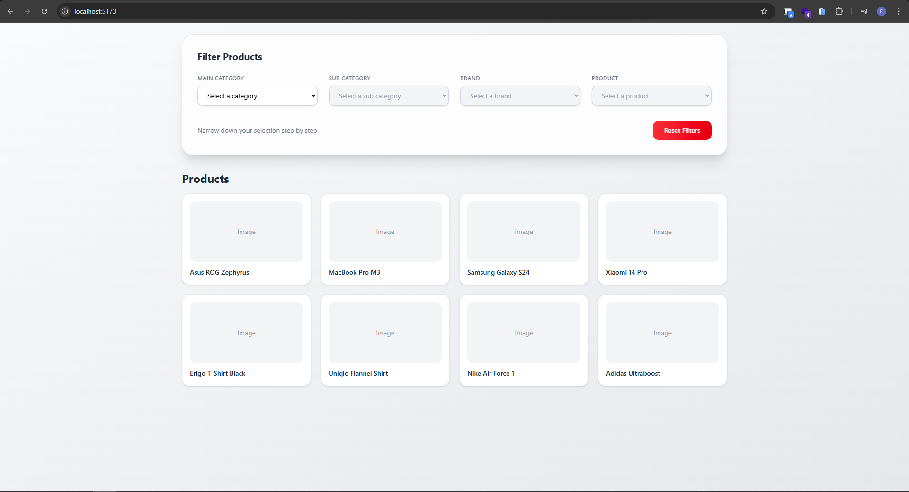
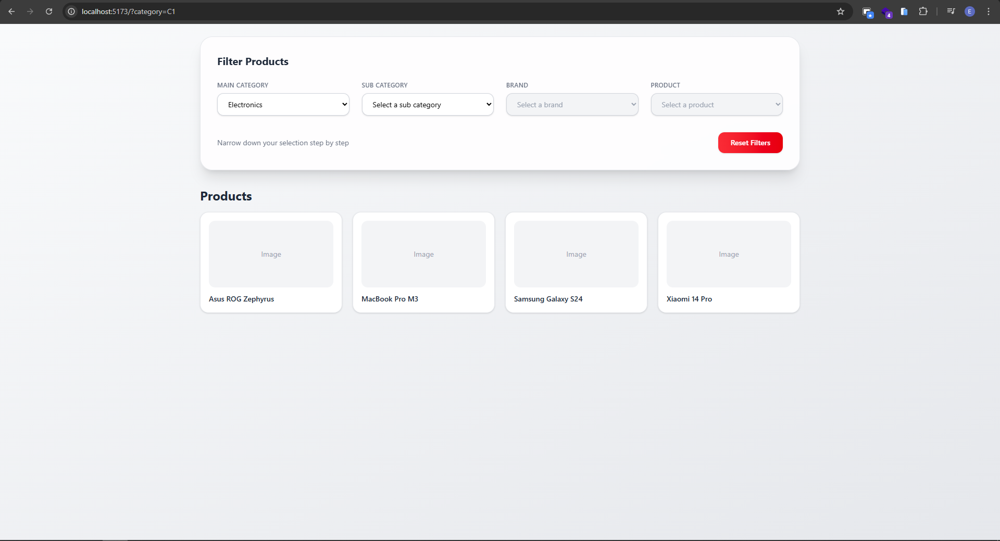
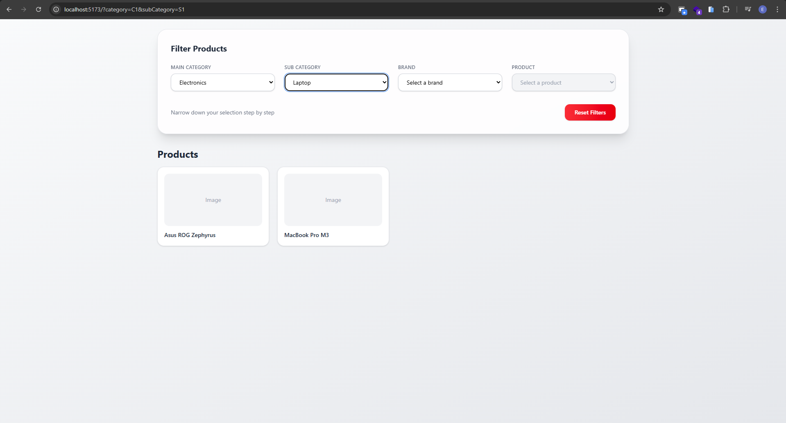
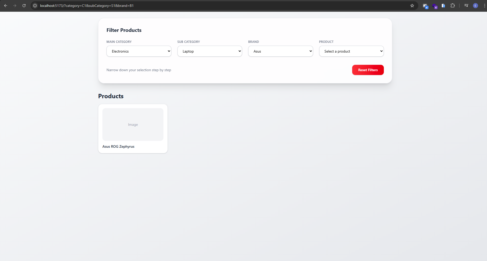
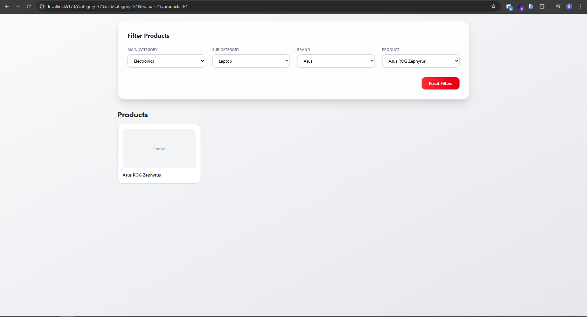

# Code Challenge 1

A small Vite + React + TypeScript demo that implements a cascading selector (Main Category → Sub Category → Brand → Products). Selections are stored in the URL query parameters so the UI is shareable and deep-linkable.

**Tech Stack:**

- React
- TypeScript
- Vite
- Tailwind CSS

## Features

- Cascading selects: category → sub-category → brand → product
- URL-sync: selections reflect in query params (`category`, `subCategory`, `brand`, `products`)
- Reset button clears selections and (intended) query params

## Getting Started

Prerequisites: Node.js (or bun/pnpm) and a package manager.

Install dependencies:

```bash
npm install
```

Run development server:

```bash
npm run dev
```

Build for production:

```bash
npm run build
```

Preview production build:

```bash
npm run preview
```

Lint the project:

```bash
npm run lint
```

## Project Structure (important files)

- [src/App.tsx](src/App.tsx) — main UI with selects and URL sync logic
- [src/main.tsx](src/main.tsx) — app entry
- [src/assets/data.json](src/assets/data.json) — sample data used to populate selects
- `vite.config.ts`, `tsconfig.json` — build and TypeScript configs

## Notes

- The app reads and writes the following query parameters: `category`, `subCategory`, `brand`, `products`.
- The `Reset` button clears in-memory selection state; to persist the URL reset behavior you can call `navigate({ search: '' })` after clearing params in `handleReset` (see `src/App.tsx`).

## License

This repository is provided as-is for the coding challenge.

# React + TypeScript + Vite

This template provides a minimal setup to get React working in Vite with HMR and some ESLint rules.

Currently, two official plugins are available:

- [@vitejs/plugin-react](https://github.com/vitejs/vite-plugin-react/blob/main/packages/plugin-react) uses [Oxc](https://oxc.rs)
- [@vitejs/plugin-react-swc](https://github.com/vitejs/vite-plugin-react/blob/main/packages/plugin-react-swc) uses [SWC](https://swc.rs/)

## React Compiler

The React Compiler is not enabled on this template because of its impact on dev & build performances. To add it, see [this documentation](https://react.dev/learn/react-compiler/installation).

## Screenshoot






